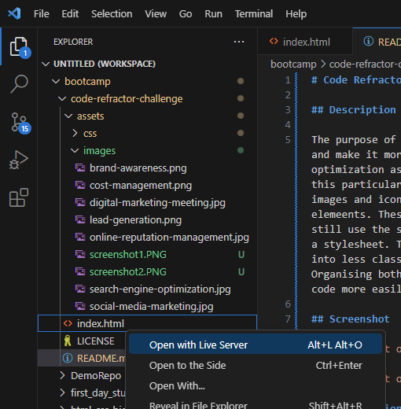

# Code Refactor Challenge


<details>
  <summary>Table of Contents</summary>
  <ol>
    <li><a href="#Description">Description</a></li>
    <li><a href="#Screenshot">Screenshot</a></li>
    <li><a href="#Installation ">Installation</a></li>
    <li><a href="#Usage">Usage</a></li>
    <li><a href="#Link to live website">Link to live website</a></li>
    <li><a href="#Credits">Credits</a></li>
    <li><a href="#License">License</a></li>
  </ol>
</details>


## Description


The purpose of this code refactor challenge was to take already existing HTML and CSS code and make it more accessible for web users. Doing so also helps with search engine optimization as accessible web sites are better positioned in search engines like Google. For this particular challenge I had to add semantic HTML elements to the webpage, make sure all images and icons have accessible alt attributes, and add short and descriptive titles to some elements. These all help with things like screen readers and allow vision impaired users to still use the site. Another thing that this project looked at is consolidating and organising a stylesheet. The original CSS code had a lot of repeated styling that I have consolidated into less classes as having multiple classes that do the same styling is redundant. Organising both the HTML and CSS files semantically helps future developers to work on this code more easily.


## Screenshot


## Installation


To install this project clone the repo
    ```
    git clone git@github.com:Dominik-Jad/code-refractor-challenge.git
    ```
    <br>
Open the files in VS Code and select 'Open With Live Server' on index.html





Any changes you make to the HTML and CSS will be automatically updated on the live server.


## Usage


This project can be used for educational purposes to show new developers some of the ways to make their websites accessible to all users as well as the importance of keeping their code clear and concise for other developers to make additions to.


## Link to live website


https://dominik-jad.github.io/code-refactor-challenge/


## Credits
Markdown syntax - https://docs.github.com/en/get-started/writing-on-github/getting-started-with-writing-and-formatting-on-github/basic-writing-and-formatting-syntax
<br>


Semantic elements guide - https://www.w3schools.com/html/html5_semantic_elements.asp


## License


Please refer to the LICENSE in the repo.
